# Lidar_RTK_Calib_SDK
[TOC]


### 功能 

使用`手眼标定`法计算Lidar和INS(RTK or IMU)的相对姿态


### 手眼标定原理

https://github.com/jhu-lcsr/handeye_calib_camodocal

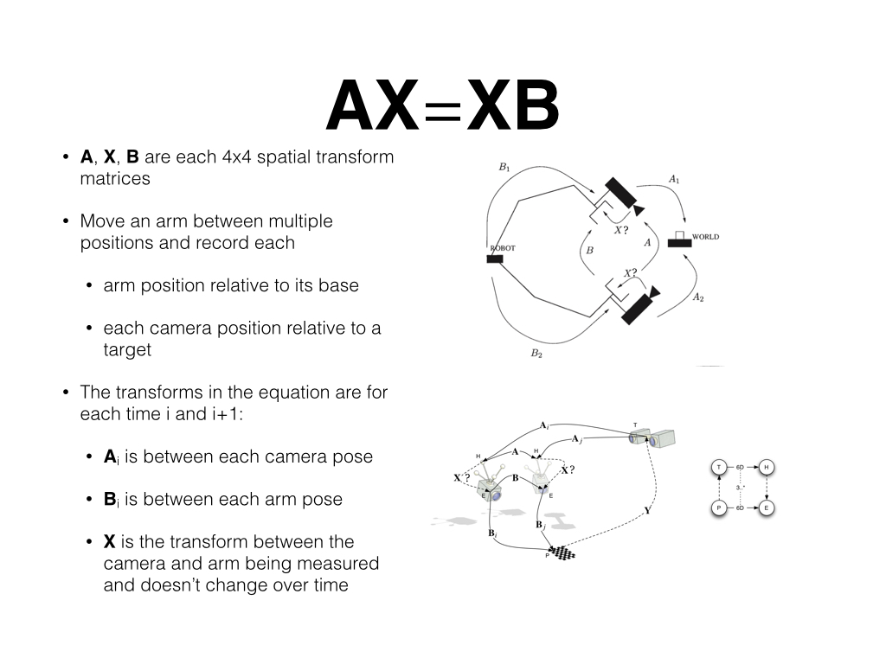 

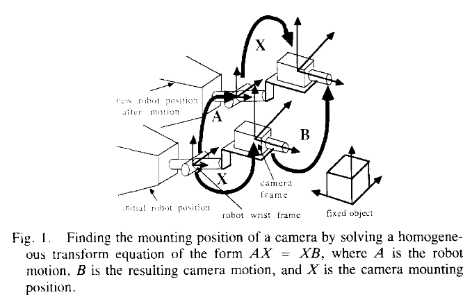

[论文](doc/Optimal Hand-Eye Calibration.pdf)

### 姿态表示

geometry_msgs::PoseWithCovarianceStamped

http://docs.ros.org/lunar/api/geometry_msgs/html/msg/PoseWithCovarianceStamped.html

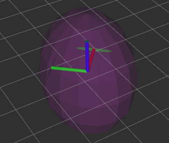

### 编译

catkin_ws/src目录下

```shell
git clone http://192.168.10.192:8800/quchunlei/lidar_rtk_calib.git
cd ../
catkin build
source devel/setup.zsh 
```

### 数据采集

- 消息格式

  | topic | msg                     |
  | ----- | ----------------------- |
  | 点云  | sensor_msgs/PointCloud2 |
  | rtk   | sensor_msgs/NavSatFix   |
  | imu   | sensor_msgs/Imu         |

  

- 在室外开阔场地，周围有建筑物，如下图

  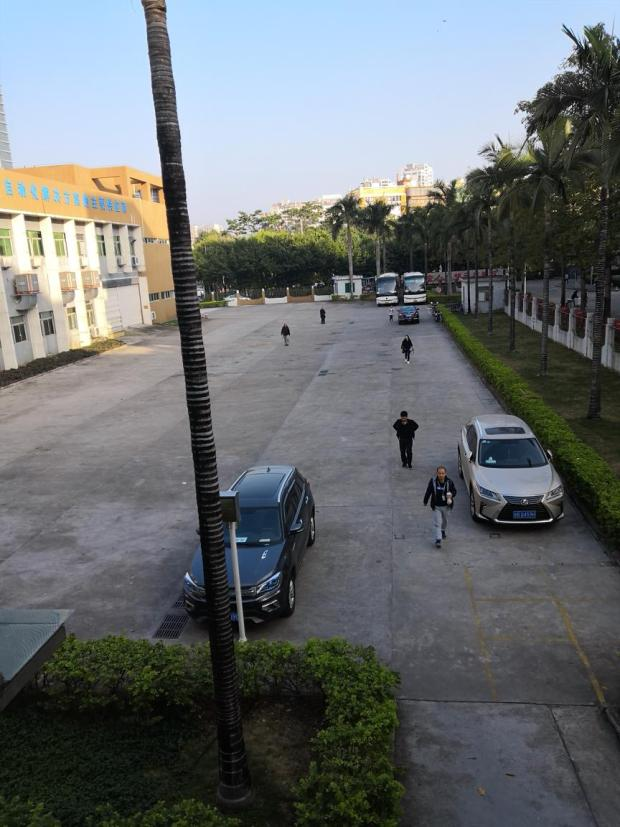

- 录制数据

  车辆先静止2-5秒，再以5公里每小时的速度行驶2个`8`字形

  ```shell
  rosbag record -a 
  ```

  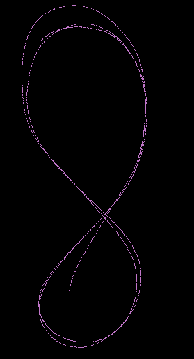

### 运行

#### 测试数据

smb: /xxx/cali_8zixing_rtk.bag

md5： 00fa5625d8b3d6a8077ce73f654228a5


```shell
roslaunch lidar_rtk_calibration run_calib.launch

```

#### 标定计算 

run_calib.launch

|                 |                   | 备注                    |
| --------------- | ----------------- | ----------------------- |
| calib_bag_file  |                   | 使用绝对路径            |
| imu_topic       |                   | rtk自带的imu            |
| lidar_topic     |                   |                         |
| rtk_topic       |                   |                         |
| lidar_pose_file | lidar每一帧的位姿 | 从rs_mapping 工具包得到 |
| save_file       | 输出数据          | 使用绝对路径            |

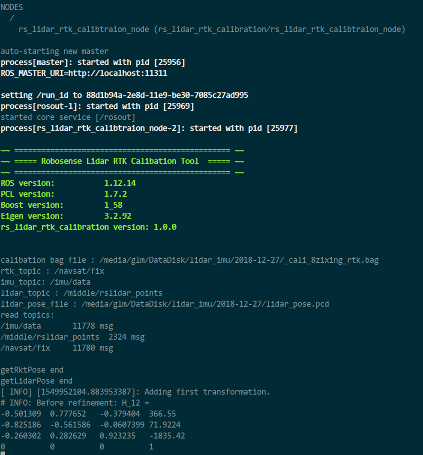

计算过程需要几十秒，计算结束


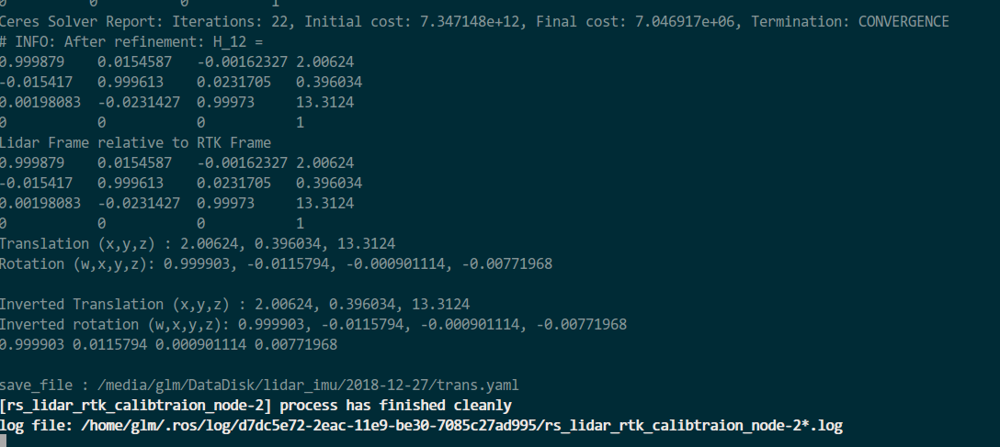

```shell
Translation (x,y,z) : 2.00624, 0.396034, 13.3124（手动改为0）
Rotation (w,x,y,z): 0.999903, -0.0115794, -0.000901282, -0.00771969

```

标定结果z值需要手动改为0或测量值

####  验证

```shell
roslaunch rs_lidar_rtk_calibration sim_rtk_mapping.launch
```

修改launch文件的topic和标定参数，理想的标定结果下，点云在固定坐标系`odom`下保持静止。错误的标定结果会导致车辆掉头后点云上下和左右移动。IMU测量值的抖动或导致点云绕基准摇晃，这不是标定错误导致的。


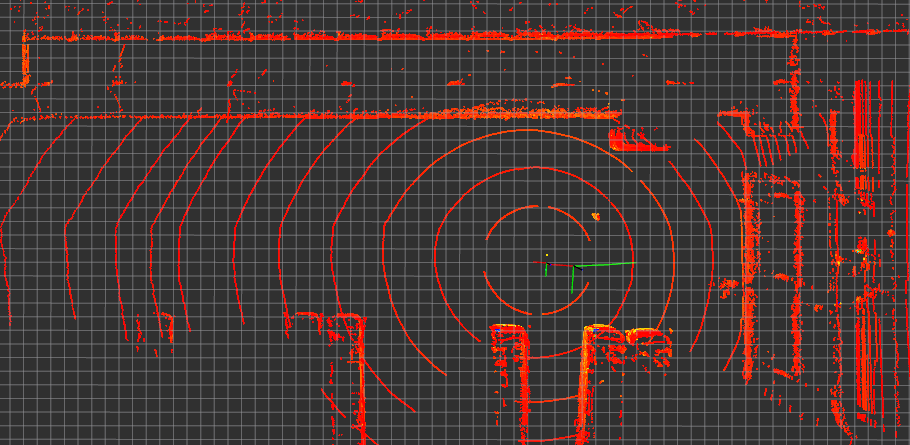

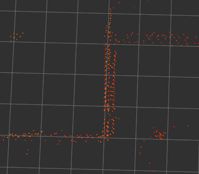

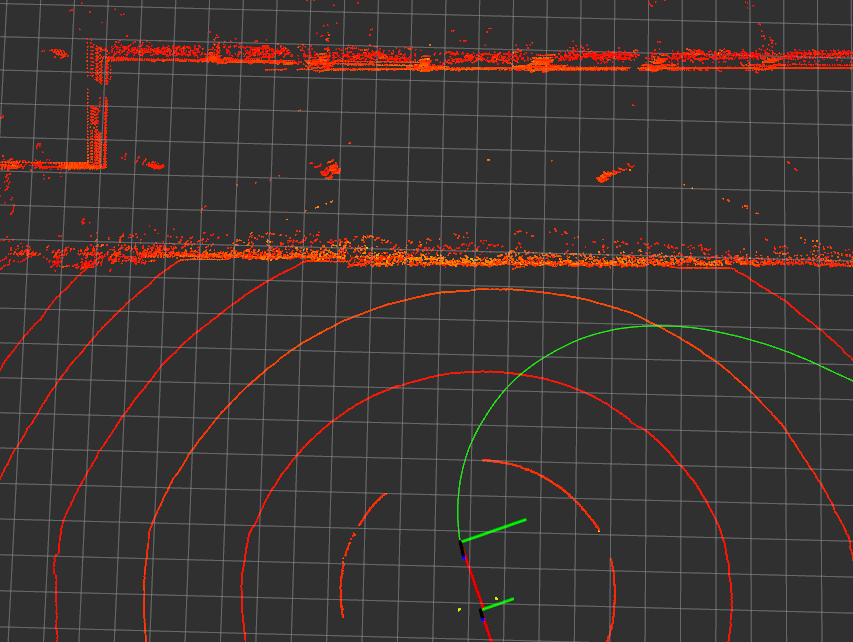

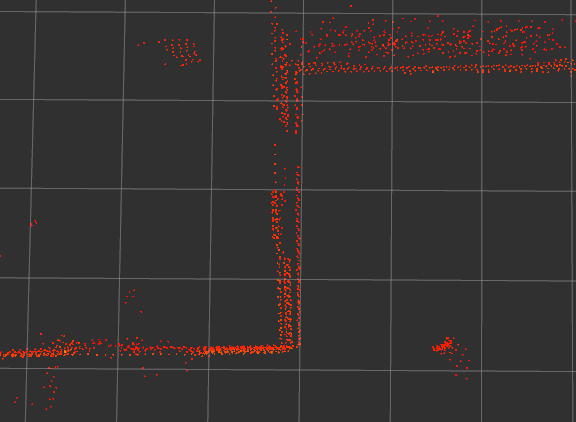

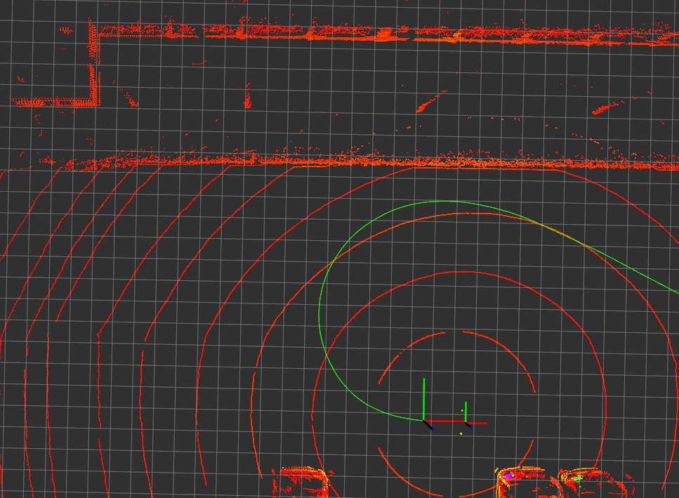

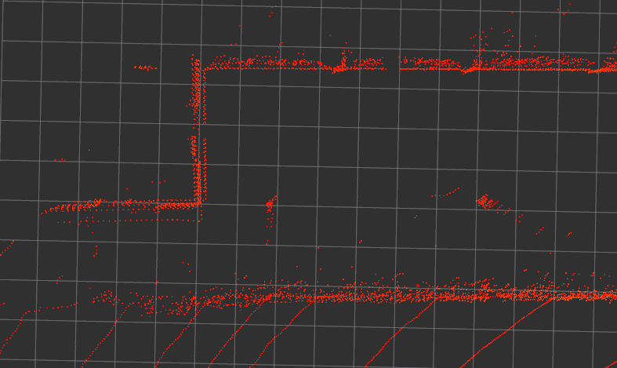

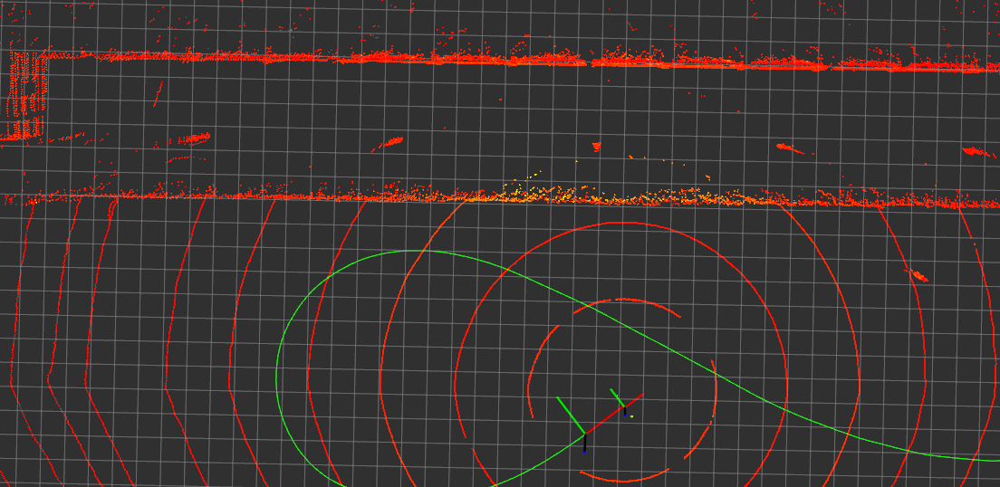

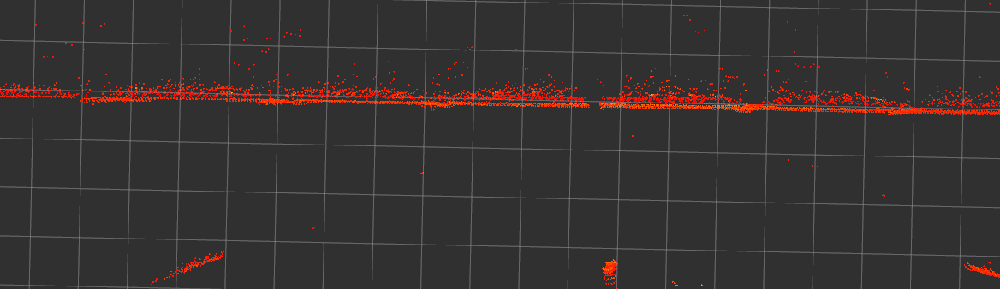


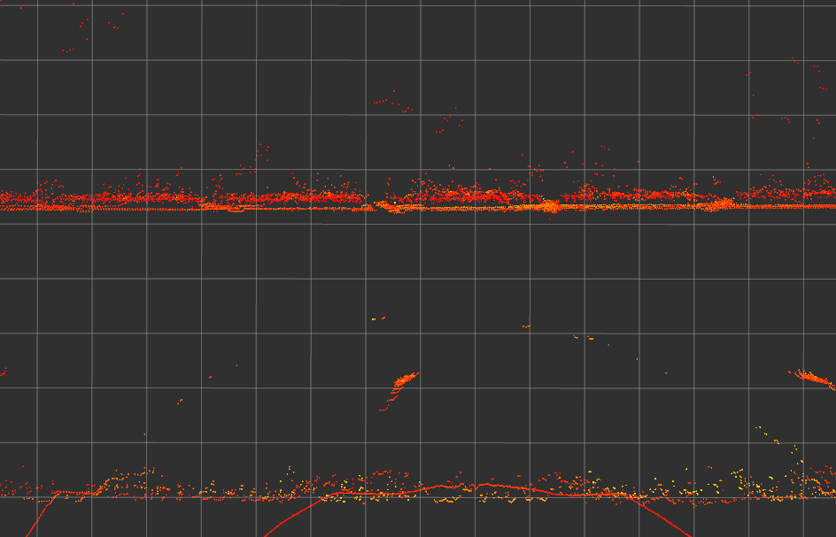